# Pose estimation and point-cloud perception (undergraduate thesis + Jilin University lab)

## Pose estimation

My undergraduate thesis focused on object pose estimation. Taking an RGB image and the 3D model of the detected object as input, I mapped 2D image pixels onto the 3D point cloud of the model's surface. From that correspondence I regressed the object's pose using PnP (Perspective-n-Point) and RANSAC. The approach also pairs with a deep-learning refinement step that improves accuracy further once PnP has produced an initial pose. The experiments showed that establishing an explicit mapping between the 2D plane and 3D space yields more accurate pose estimates than the comparable methods.

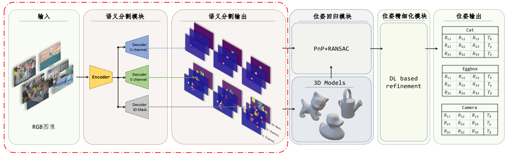

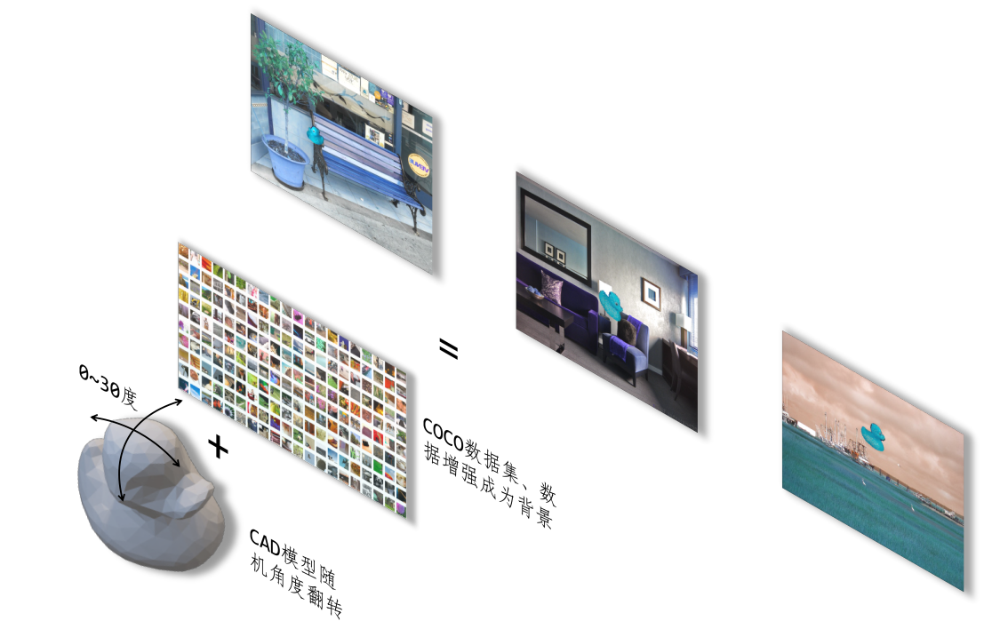

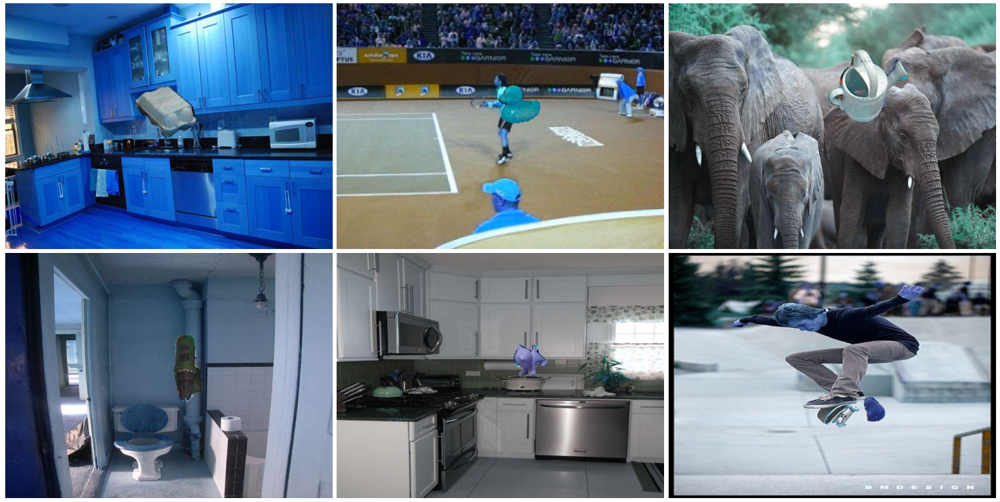

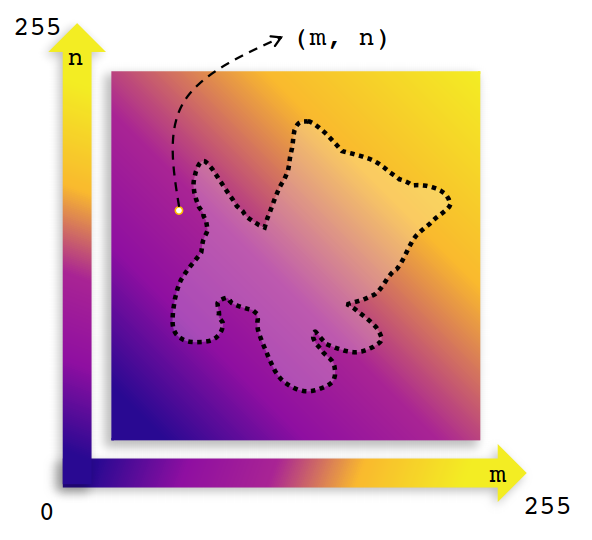

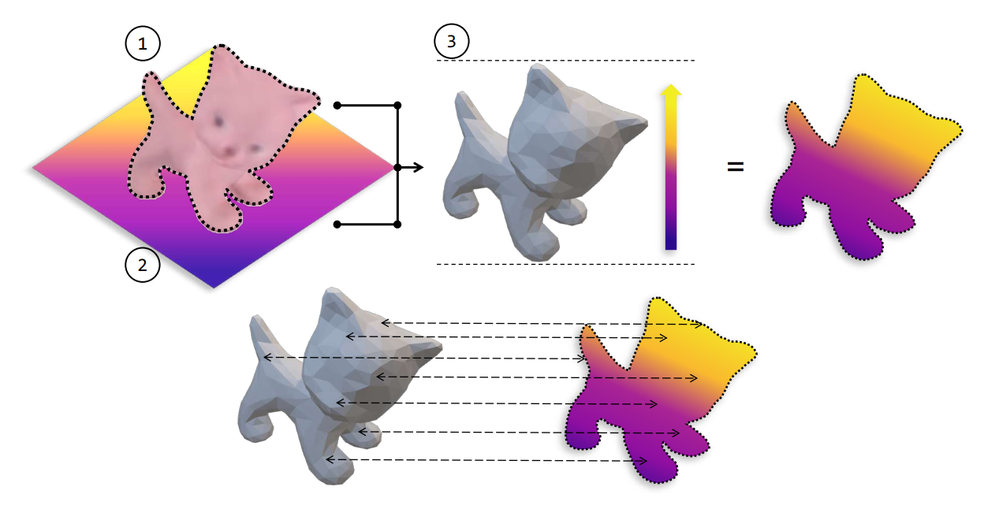

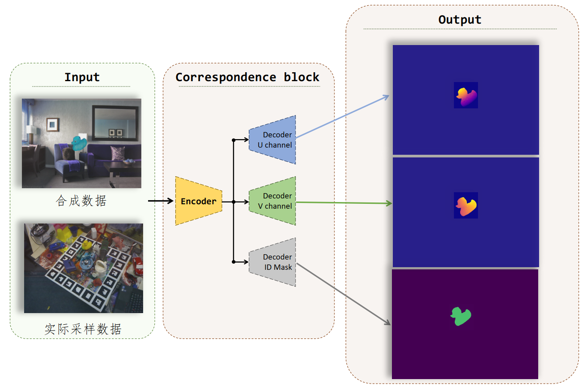

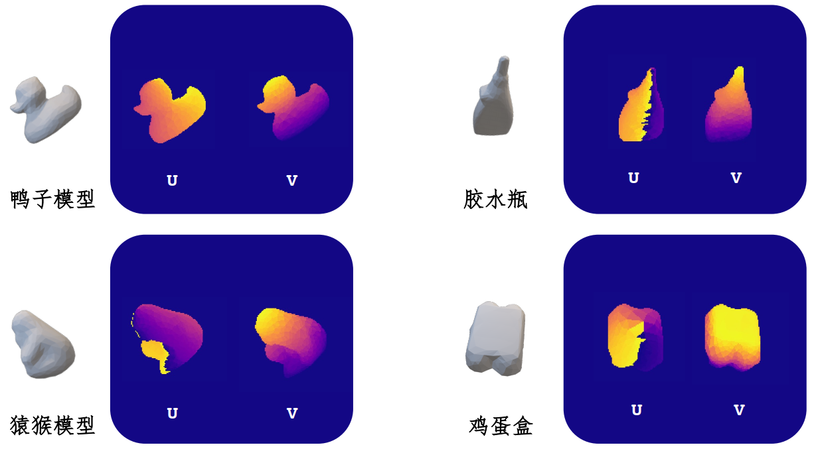

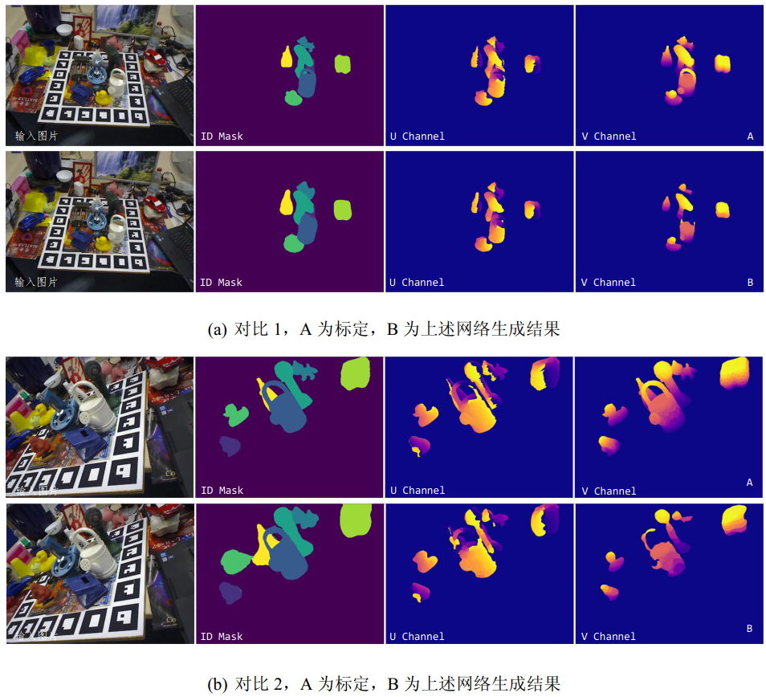

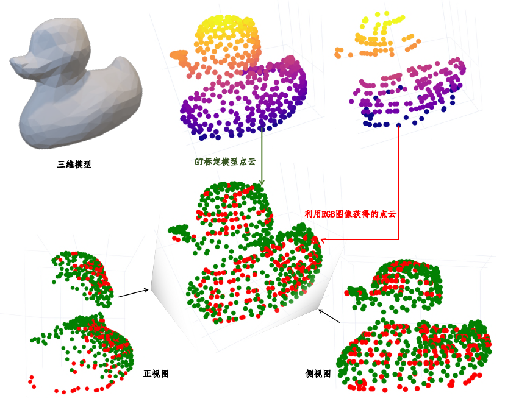

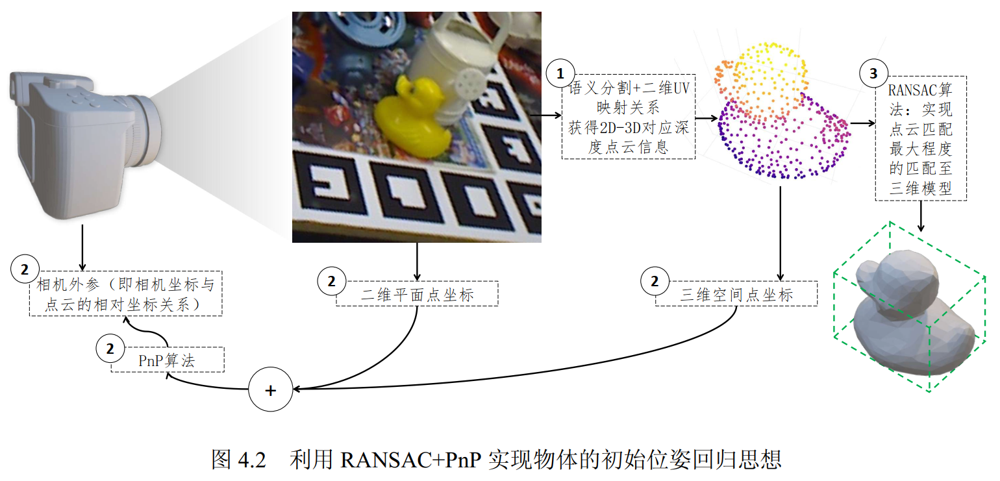

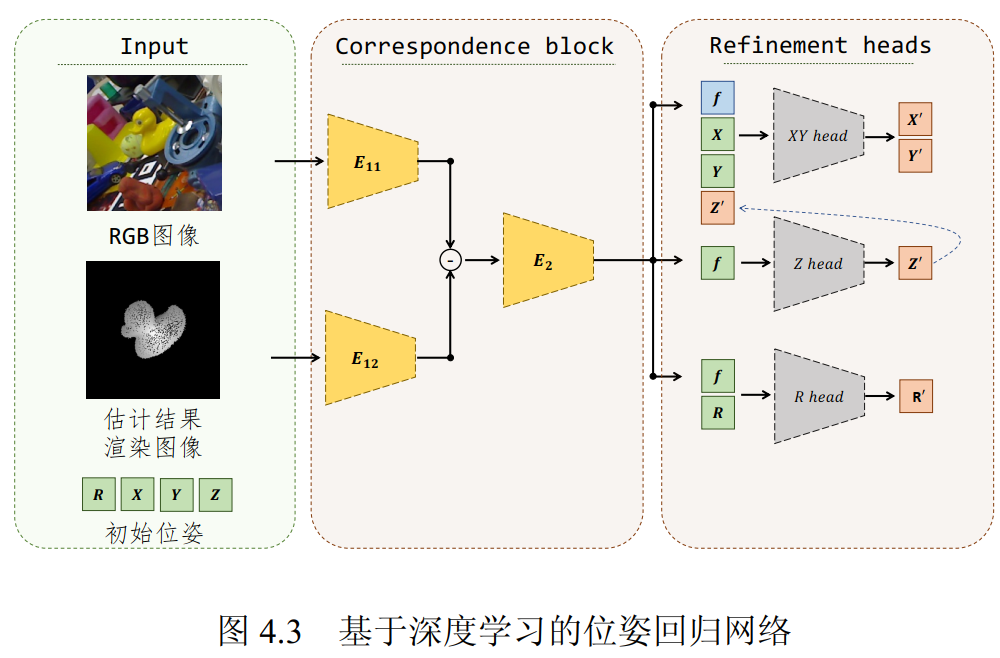

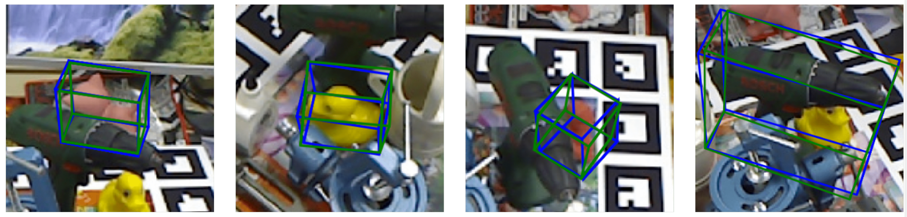

## Point-cloud perception

In my senior year I worked mainly on point-cloud perception in the lab at Jilin University, starting with converting data from the Livox format into KITTI format.

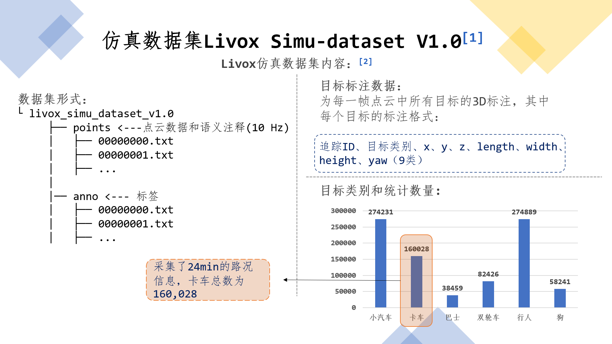

I then trained PointPillars on the Livox dataset and implemented forward inference.

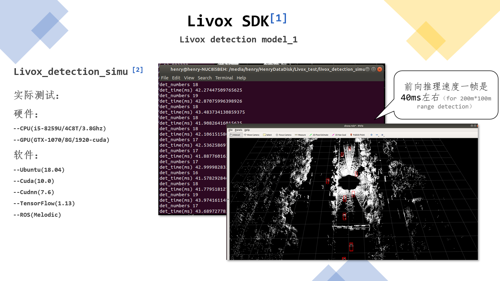
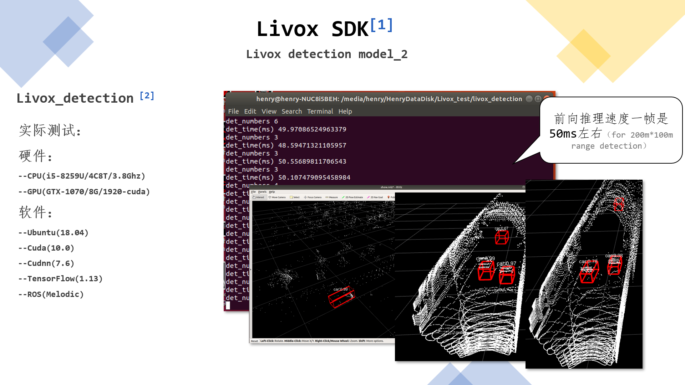

The experience gave me a systematic view of point-cloud processing methods, and a much clearer sense of where purely point-cloud approaches fall short in real object recognition. That is what got me interested in fusing point-cloud and visual perception.

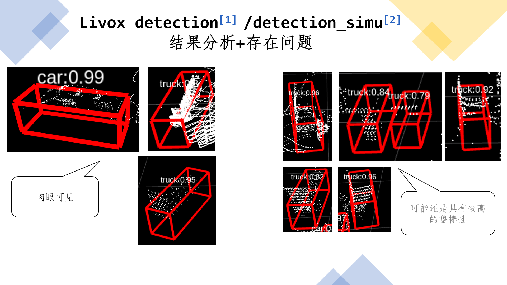
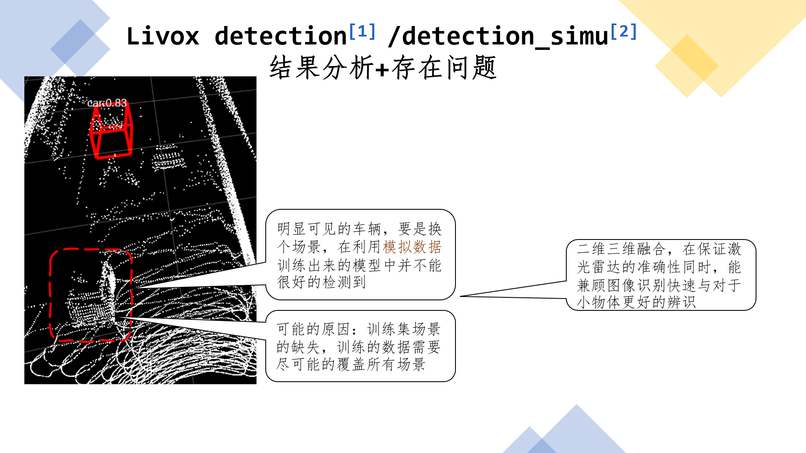
