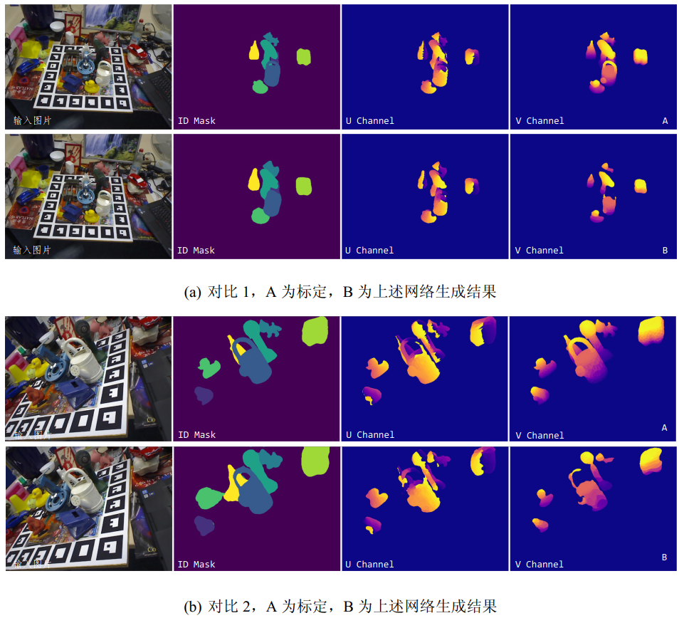

# Pose estimation and point cloud perception
## Pose estimation

My undergraduate thesis focused on the estimation of object poses. I input RGB images and the 3D models of the detected objects, mapping the 2D image pixels to the 3D point cloud of the model. Based on this, I utilized PnP (Perspective-n-Point) and RANSAC algorithms to regress the pose and achieve object pose recognition. Additionally, this approach incorporated a deep learning-based refinement algorithm to further improve the pose accuracy based on the initial pose estimation from PnP. Experimental results demonstrated that, compared to other related works, establishing the mapping relationship between the 2D plane and 3D space enabled higher accuracy in pose estimation.

 of an object")

## Point cloud perception
During my senior year, I primarily focused on point cloud perception in the laboratory at Jilin University. I accomplished the data format conversion from the Livox dataset to the KITTI dataset. 

Additionally, I successfully trained and implemented the PointPillars model using the Livox dataset for forward inference. 

Through this experience, I gained knowledge of various methods for point cloud processing and became aware of their limitations. It also sparked my interest in exploring the fusion of point cloud and visual perception.

