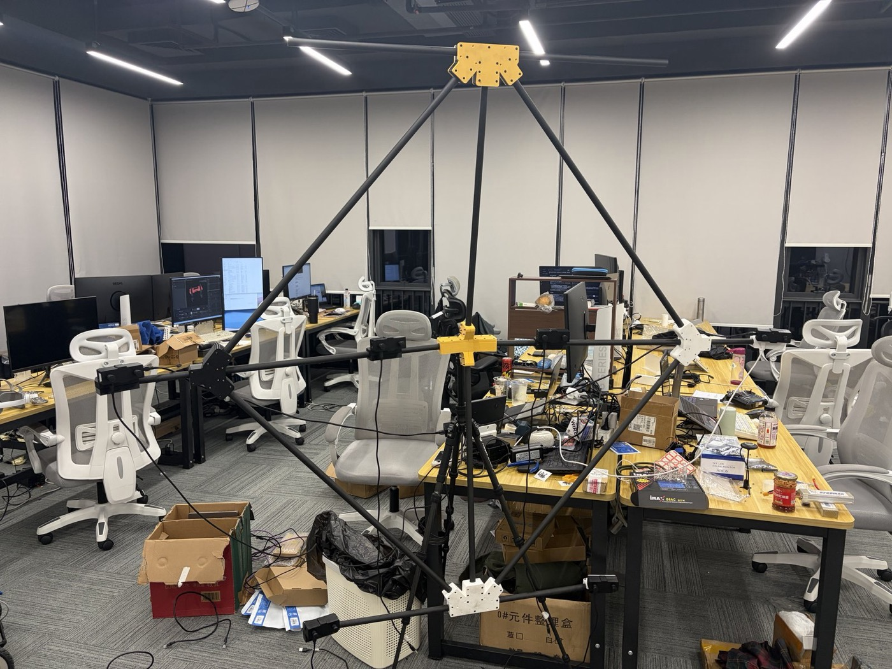
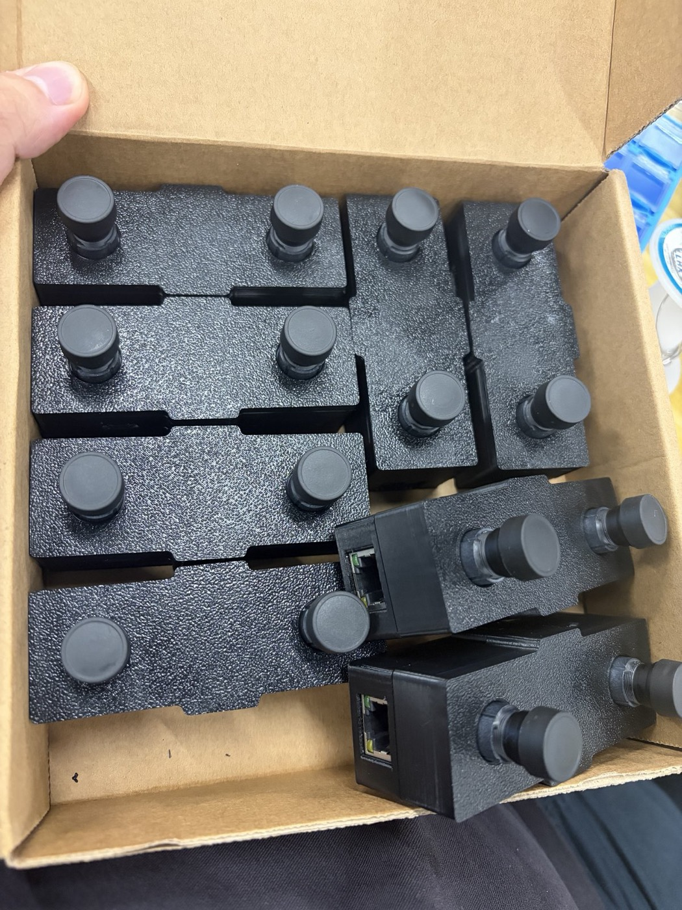
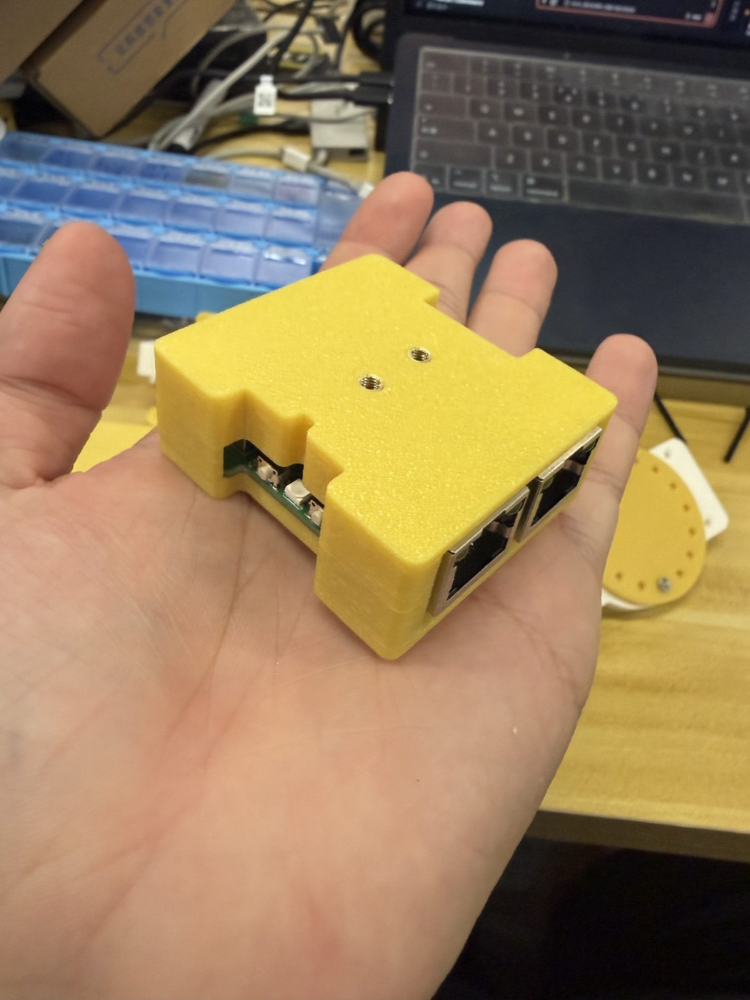
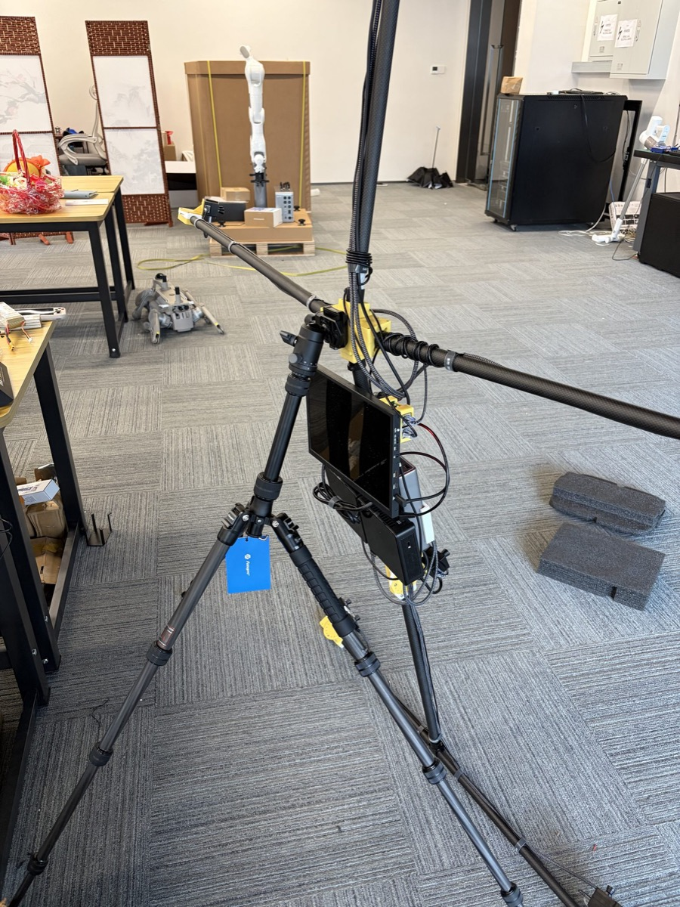
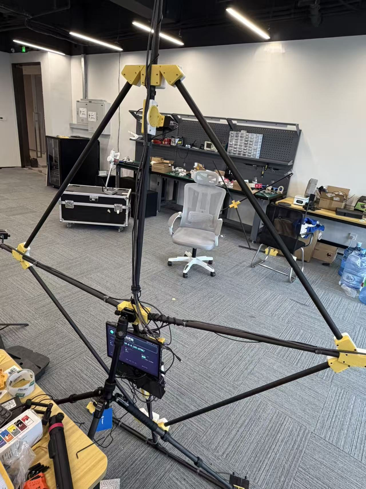
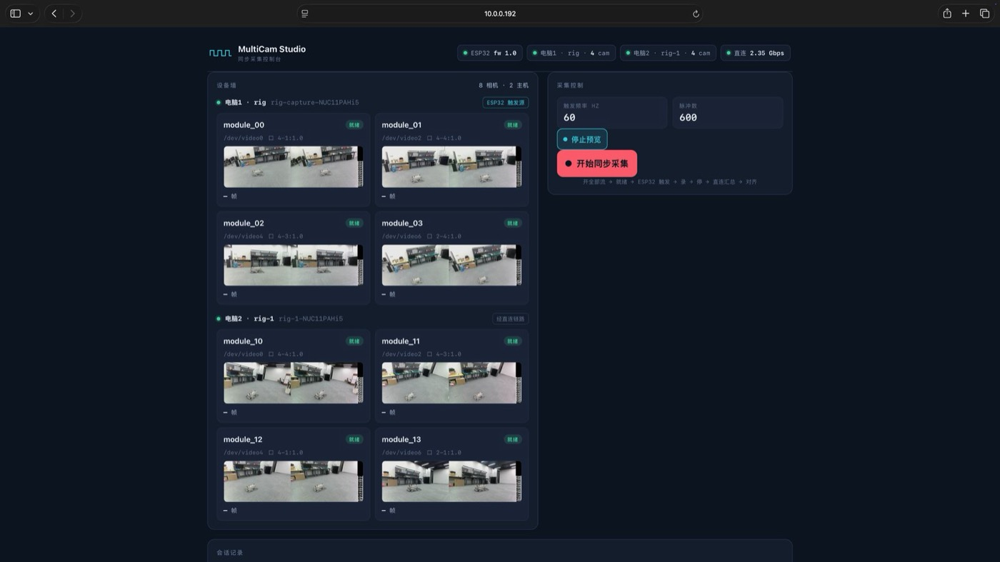
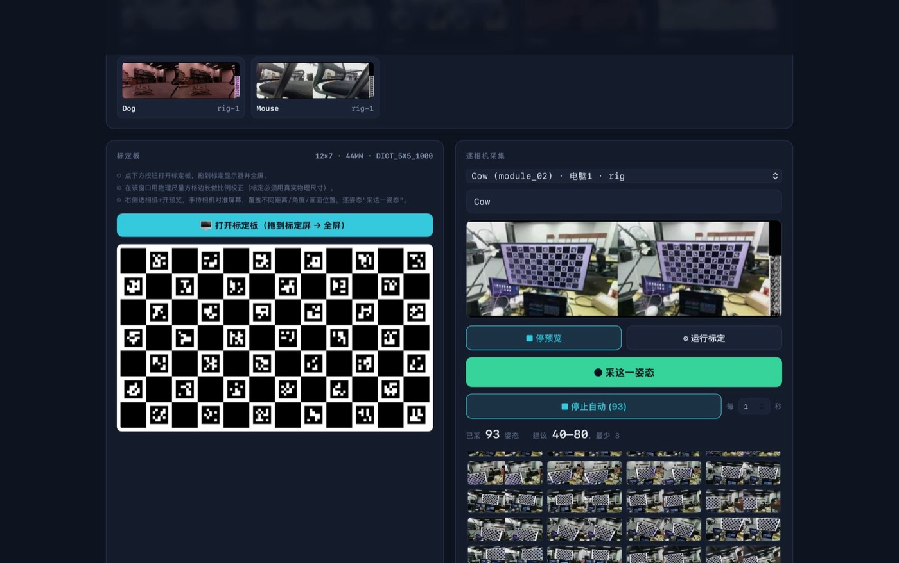
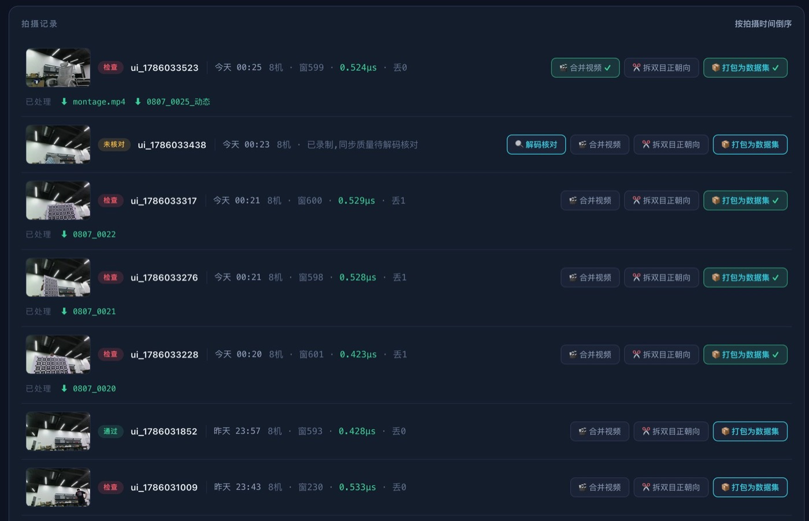
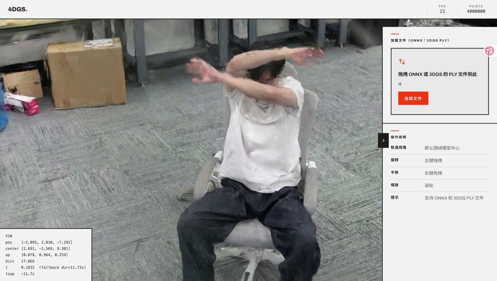
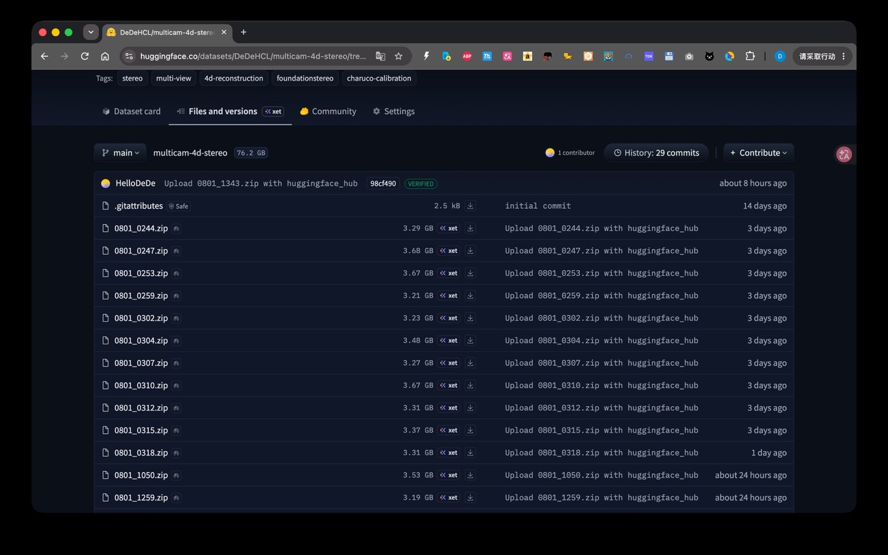

# Multi-camera 4D capture system

A **dynamic 4D capture device** I designed, built and wrote the software for: 8 stereo camera modules (16 streams) synchronized to sub-microsecond precision by an ESP32 gated trigger, on a carbon-fiber frame that one person can strike without tools, running on a USB power bank, with capture and calibration both done in the browser. The data feeds straight into a 4D Gaussian reconstruction pipeline, and the result ships as 4DGS that plays live in a web page.

| | |
| --- | --- |
| Cameras | 8 stereo modules / 16 streams · 1920×1200 |
| Cross-camera sync jitter | **~0.4 µs** (holds across two hosts) |
| Calibration | 8/8 passing · stereo RMS ≈ 0.6px · baseline 59.35–59.83mm |
| Portability | Tool-free one-person teardown · battery powered · array can follow the subject |
| Datasets | 23 static-array + 2 moving-array scenes (with IMU) · 83.4 GB |
| Browser playback | 4M Gaussians / 267 MB · ~20 fps on an M5 Mac |

## Capture: 16 streams, 0.4 µs sync

The cameras are configured as **pure trigger slaves — no pulse, no frame** — with a single ESP32 gated trigger driving all eight trigger lines in parallel. Software issues one command, the ESP32 emits a precise pulse from a hardware timer, and all eight expose at the same instant: measured cross-camera jitter is **~0.4 µs**, and it stays in that range across two host machines. That logic later became a standalone four-channel sync box, two cascaded to cover all eight modules.

Each module carries a side-by-side stereo pair with a built-in baseline of ≈ 59.5mm — the physical baseline that gives the whole reconstruction its metric scale.

The 8 synchronized stereo streams merge into a grid for review — each cell is one camera at the same instant, **same frame index = same trigger instant**:

<video controls playsinline preload="metadata" style="width: 100%; border-radius: 8px; margin: 0.75rem 0 1.25rem;">
  <source src="capture-grid.mp4" type="video/mp4">
  Your browser cannot play this video.
</video>

## Portable: fits in a car boot, and walks with you

Columns, beams, camera modules, sync boxes and power are all independent, and the rig goes up or down **tool-free, by one person**. Camera modules attach to beams via quick-release mounts with locating pins, and it is those pins that make placement repeatable — without them, calibration could not be reused across sessions. Power comes from a USB power bank, so no cable has to be run to the rig. Wobble at the far camera positions was solved with diagonal carbon-fiber braces, themselves quick-release.

That unlocked a new mode of capture: **the entire camera array walks along with the subject**. Watch the background across the grid — within one take it moves from an open area over to the workbench, because the subject is walking and the rig is walking too.

<video controls playsinline preload="metadata" style="width: 100%; border-radius: 8px; margin: 0.75rem 0 1.25rem;">
  <source src="scene-move.mp4" type="video/mp4">
  Your browser cannot play this video.
</video>

## Software: capture, calibration and export all in the browser

No client to install — a phone, tablet or laptop just opens the LAN address. A device wall aggregates the 8 cameras across 2 hosts with live preview, and one click runs the whole sequence: open all streams → ready → ESP32 trigger → record → stop → cross-host collection → alignment report, with a 2.35 Gbps direct link between the two NUCs. Exposure parameters broadcast to all 16 streams in one click and are read back per stream to verify.

Calibration happens in the same web app: the screen displays a `12×7 · 44mm · DICT_5X5_1000` board at its true physical size, poses are captured automatically at ~1Hz while the camera is moved by hand, and one click produces the intrinsics. All eight pass, with baselines clustered in **59.35–59.83mm — a total spread of just 0.5mm**:

| Camera | Cat | Cow | Dog | Fish | Mouse | Pig | Sheep | Tiger |
| --- | --- | --- | --- | --- | --- | --- | --- | --- |
| Stereo RMS (px) | 0.6154 | 0.5927 | 0.6119 | 0.5985 | 0.5993 | 0.6163 | 0.5941 | 0.6857 |
| Baseline (mm) | 59.832 | 59.366 | 59.351 | 59.467 | 59.573 | 59.595 | 59.666 | 59.627 |

The take list carries thumbnails and sync quality, and export automatically avoids the timeline discontinuities caused by dropped frames, so an exported segment has a strictly uniform time axis (adjacent frames always exactly one trigger period apart) and drops straight into a reconstruction pipeline.

Feeding the calibrated intrinsics through FoundationStereo yields per-pixel metric depth, and unprojecting it gives a true-color, correctly scaled 3D point cloud:

")

## Reconstruction results

**FreeTimeGS** is the main line — each Gaussian carries a velocity vector and a lifetime, so fast motion is expressed as a relay of short-lived Gaussians. All 16 streams, full 1920×1200 resolution:

| Metric | Result |
| --- | --- |
| PSNR ↑ | 20.7 → **23.3** |
| SSIM ↑ | 0.74 → **0.79** |
| LPIPS ↓ | 0.534 → **0.393** |
| Gap to ground truth at facial edges | **48% closed** |
| Fast-limb error | **−13%**, beating the baseline for the first time |

Free-viewpoint orbit · ±74cm laterally · 1918×1198 · 2× supersampling:

<video controls playsinline preload="metadata" style="width: 100%; border-radius: 8px; margin: 0.75rem 0 1.25rem;">
  <source src="recon-best.mp4" type="video/mp4">
  Your browser cannot play this video.
</video>

 vs render (right) · 6 frames")

### Reconstructing from a moving array

The array moves while the subject walks — two layers of motion stacked. Relative poses *within* the rigid body still hold, but the array's pose relative to the world changes every frame, so a per-frame 6-DoF global pose has to be estimated as well. The array being rigid, with a physical baseline for scale, makes that tractable.

<video controls playsinline preload="metadata" style="width: 100%; border-radius: 8px; margin: 0.75rem 0 1.25rem;">
  <source src="moving-recon.mp4" type="video/mp4">
  Your browser cannot play this video.
</video>

Compared against **LetCamsGo** (as far as I know, the only public work on "cameras moving during capture + dynamic scene"):

| Method | Per-scene PSNR (Lunch / Blackboard / Play) | Mean |
| --- | --- | --- |
| **Ours (500K best configuration)** | — | **22.11** |
| LetCamsGo "Ours" | 21.07 / 19.23 / 16.85 | 19.05 |
| Their FTGS\* run (same backbone as ours) | 20.12 / 18.60 / 15.90 | 18.21 |
| Their MoSca run | 20.40 / 18.86 / 16.08 | 18.45 |

The evaluation protocol behind that +3.06 dB is **not yet fully aligned**, so I am not treating it as a conclusion — more moving-array scenes are being captured for a controlled comparison.

## 4DGS in the browser

No software to install: open a link and the dynamic Gaussian scene plays — **parametric pruning of the Gaussian model plus WebGPU rendering**, with models distributed over a CDN and playback starting as soon as loading finishes.

> Live demo: <https://dede-4dgs.zeabur.app/>　(Chrome recommended; the first load downloads a 267–437 MB model)

<video controls playsinline preload="metadata" style="width: 100%; border-radius: 8px; margin: 0.75rem 0 1.25rem;">
  <source src="web4dgs-screen.mp4" type="video/mp4">
  Your browser cannot play this video.
</video>

Frame rate is entirely device-bound. The full 6.55M-Gaussian version of the same scene runs at 3 fps in a native viewer on an RTX 3060 laptop and occupies 6 GB of VRAM; the pruned 4M version runs at about **20 fps** in the browser on an M5 Mac.

## Datasets

Every dataset ships as split left/right streams plus each camera's own calibrated intrinsics, on a strictly uniform time axis, ready to feed a reconstruction pipeline. The static array covers 23 scenes, moving-array captures with IMU are archived separately as 2 scenes, 83.4 GB in total. The material spans large-deformation cloth, multi-person occlusion, wide-area standing activity and the moving array.

## What's next

- **Reconstruction**: capture more moving scenes for controlled validation and close the protocol gap behind that +3.06 dB;
- **Web playback**: separate foreground from background (3DGS for the static background, 4DGS only for what moves) and switch the rendering backend to fastgs, for faster loading and steadier frame rates;
- **Hardware**: validate in the field whether calibration survives teardown, transport and reassembly — the one genuine risk in the demountable design;
- **Expressive power**: move to dynamic appearance residuals. The current color model is fixed per Gaussian and cannot express the shadows and teeth that appear as expressions change.
