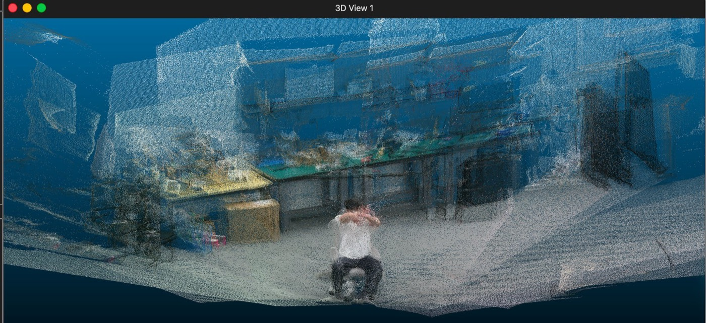
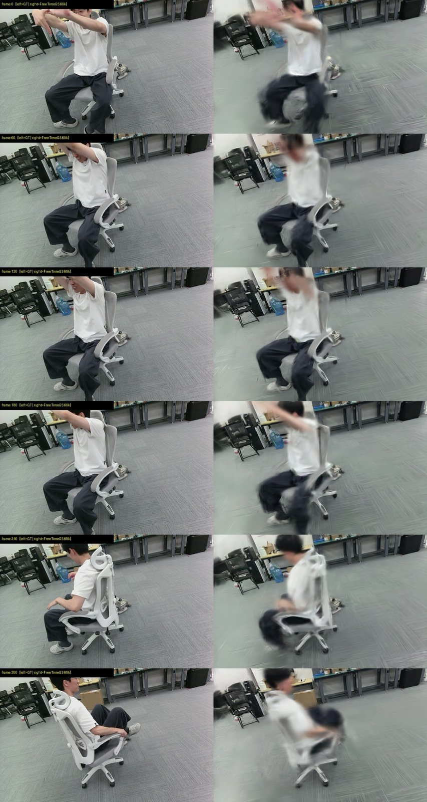

# 多相机 4D 采集系统

自己设计、自己造、自己写软件的一套**动态 4D 采集设备**：8 组双目相机（16 路）由 ESP32 门控触发做到亚微秒同步，整机碳纤维、单人免工具拆装、充电宝供电，采集与标定全在浏览器里完成。采下来的数据直接进 4D 高斯重建管线，结果做成打开网页就能实时播放的 4DGS。

| | |
| --- | --- |
| 相机 | 8 组双目 / 16 路 · 1920×1200 |
| 跨相机同步抖动 | **~0.4 µs**（跨两台主机一致） |
| 标定 | 8/8 合格 · stereo RMS ≈ 0.6px · 基线 59.35–59.83mm |
| 便携性 | 单人免工具拆装 · 充电宝供电 · 阵列可跟随被摄者移动 |
| 数据集 | 静态阵列 23 场景 + 移动阵列 2 场景（含 IMU）· 83.4 GB |
| 浏览器播放 | 400 万高斯 / 267 MB · M5 Mac 约 20 fps |

## 采集：16 路、0.4 µs 同步

相机被配置成**纯触发从机——没有脉冲就不出帧**，由单个 ESP32 门控触发器并联驱动全部 8 台的触发线。软件下一条指令，ESP32 用硬件定时器精确发脉冲，8 台在同一瞬间曝光，实测跨相机抖动 **~0.4 µs**，跨两台主机也是同一量级。这套逻辑后来做成了独立四路同步器，两台级联覆盖 8 组模组。

每组模组自带并排双目，模组内立体基线 ≈ 59.5mm——这条物理基线直接给整套重建提供尺度。

8 路同步立体视频合成宫格回看，每一格是一台相机的同一时刻画面，**同名帧 = 同一触发瞬间**：

<video controls playsinline preload="metadata" style="width: 100%; border-radius: 8px; margin: 0.75rem 0 1.25rem;">
  <source src="capture-grid.mp4" type="video/mp4">
  当前浏览器不支持直接播放该视频。
</video>

## 便携：能装进后备箱，还能跟着人走

立柱、横梁、相机模组、同步器、供电全部独立，**免工具、单人拆装**；相机模组与横梁之间用快拆座 + 定位销，靠定位销保证重复安装的一致性，标定才能跨场次复用。供电换成充电宝方案，整套系统不再需要往外拉电线。末端相机的晃动用斜拉碳纤维管解决，斜拉件同样支持快拆。

这直接解锁了一种新的采集方式：**整个相机阵列跟着被摄者一起移动**。看宫格里的背景，同一段视频里从开阔区域一路换到工作台旁——人在走，架子也在走。

<video controls playsinline preload="metadata" style="width: 100%; border-radius: 8px; margin: 0.75rem 0 1.25rem;">
  <source src="scene-move.mp4" type="video/mp4">
  当前浏览器不支持直接播放该视频。
</video>

## 软件：采集、标定、导出都在浏览器里

不装客户端，手机 / 平板 / 电脑打开局域网地址就能用。设备墙汇总两台主机上的 8 台相机 + 实时预览，一键跑完「全开流 → 就绪 → ESP32 触发 → 录 → 停 → 跨主机汇总 → 对齐报告」，两台 NUC 之间 2.35 Gbps 直连汇总数据。曝光参数一键广播到 16 路并逐路回读校验。

标定同样在网页里完成：屏幕按真实物理尺寸显示 `12×7 · 44mm · DICT_5X5_1000` 标定板，手持相机逐姿态 ~1Hz 自动采集，一键产出内参。8 台全部合格，基线聚集在 **59.35–59.83mm，总跨度仅 0.5mm**：

| 相机 | Cat | Cow | Dog | Fish | Mouse | Pig | Sheep | Tiger |
| --- | --- | --- | --- | --- | --- | --- | --- | --- |
| stereo RMS (px) | 0.6154 | 0.5927 | 0.6119 | 0.5985 | 0.5993 | 0.6163 | 0.5941 | 0.6857 |
| 基线 (mm) | 59.832 | 59.366 | 59.351 | 59.467 | 59.573 | 59.595 | 59.666 | 59.627 |

拍摄记录带缩略图与同步质量，导出时自动避开丢帧造成的时间断点，保证导出片段的时间轴严格均匀（相邻帧恒为一个触发周期），可直接进重建管线。

标定内参送进 FoundationStereo 即得逐像素度量深度，反投影得到带真彩、尺度正确的 3D 点云：

## 重建结果

以 **FreeTimeGS** 为主线（每个高斯自带速度向量 + 存活时长，快速运动用「短命高斯接力」表达），16 路全用、全分辨率 1920×1200：

| 指标 | 结果 |
| --- | --- |
| PSNR ↑ | 20.7 → **23.3** |
| SSIM ↑ | 0.74 → **0.79** |
| LPIPS ↓ | 0.534 → **0.393** |
| 人脸边缘与真值的差距 | **关闭 48%** |
| 快动肢体误差 | **−13%**，首次反超基线 |

自由视角环绕 · 横向 ±74cm · 1918×1198 · 2× 超采样：

<video controls playsinline preload="metadata" style="width: 100%; border-radius: 8px; margin: 0.75rem 0 1.25rem;">
  <source src="recon-best.mp4" type="video/mp4">
  当前浏览器不支持直接播放该视频。
</video>

### 移动阵列的重建

阵列移动 + 被摄者走动，两层运动叠加。刚体内部的相对位姿不变，但阵列相对世界的位姿逐帧在变，需要额外估计每帧的 6 自由度整体位姿——好在阵列是刚体、物理基线又给了尺度，这件事可解。

<video controls playsinline preload="metadata" style="width: 100%; border-radius: 8px; margin: 0.75rem 0 1.25rem;">
  <source src="moving-recon.mp4" type="video/mp4">
  当前浏览器不支持直接播放该视频。
</video>

与 **LetCamsGo**（据我所知是唯一公开做「相机采集中移动 + 动态场景」的工作）对比：

| 方法 | 逐场景 PSNR（Lunch / Blackboard / Play） | 均值 |
| --- | --- | --- |
| **我们（500K 冠军配置）** | — | **22.11** |
| LetCamsGo "Ours" | 21.07 / 19.23 / 16.85 | 19.05 |
| 他们跑的 FTGS\*（与我们同底座） | 20.12 / 18.60 / 15.90 | 18.21 |
| 他们跑的 MoSca | 20.40 / 18.86 / 16.08 | 18.45 |

这个 +3.06 dB 的**口径尚未完全对齐**，所以我没把它当成结论，正在采更多移动场景做受控验证。

## 浏览器端 4DGS

不装任何软件，打开链接即可播放动态高斯场景——**高斯模型参数化裁剪 + WebGPU 渲染**，模型经 CDN 分发，加载完成自动播放。

> 在线体验：<https://dede-4dgs.zeabur.app/>　（建议 Chrome；首次打开需下载 267–437 MB 模型）

<video controls playsinline preload="metadata" style="width: 100%; border-radius: 8px; margin: 0.75rem 0 1.25rem;">
  <source src="web4dgs-screen.mp4" type="video/mp4">
  当前浏览器不支持直接播放该视频。
</video>

帧率完全取决于设备。同一份场景的全量 655 万高斯在原生查看器 + RTX 3060 笔记本上只有 3 fps、显存占 6 GB；裁剪后的 400 万高斯版在浏览器里、M5 Mac 上约 **20 fps**。

## 数据集

每个数据集都是拆分好的左右目 + 每台相机自带标定内参，时间轴严格均匀，可直接进重建管线。静态阵列累计 23 个场景，移动阵列 + IMU 单独建库 2 个场景，共 83.4 GB。素材覆盖大幅形变织物、多人遮挡、大范围站姿活动与移动阵列几类难点。

## 下一步

- **重建**：采更多移动场景做受控验证，把 +3.06 dB 的口径彻底对齐；
- **Web 播放**：前后景分离（静止背景用 3DGS、动态部分才用 4DGS），渲染底座换成 fastgs，目标是更快加载、更稳帧率；
- **硬件**：外场验证「拆卸—搬运—复位」后的标定复用性，这是全可拆卸方案唯一的真风险点；
- **表达能力**：转向动态外观残差——当前颜色模型每个高斯固定不变，表达不了表情变化带来的阴影与牙齿显露。
