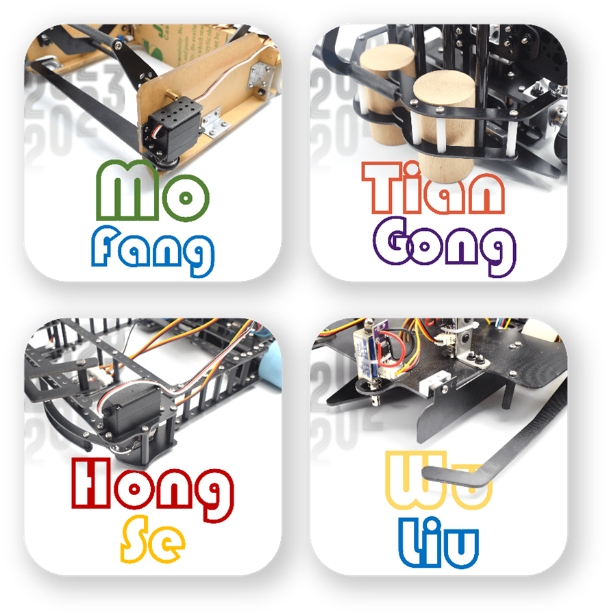
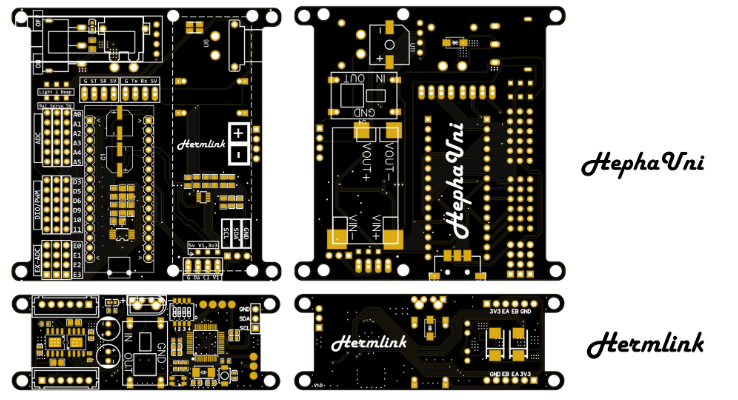
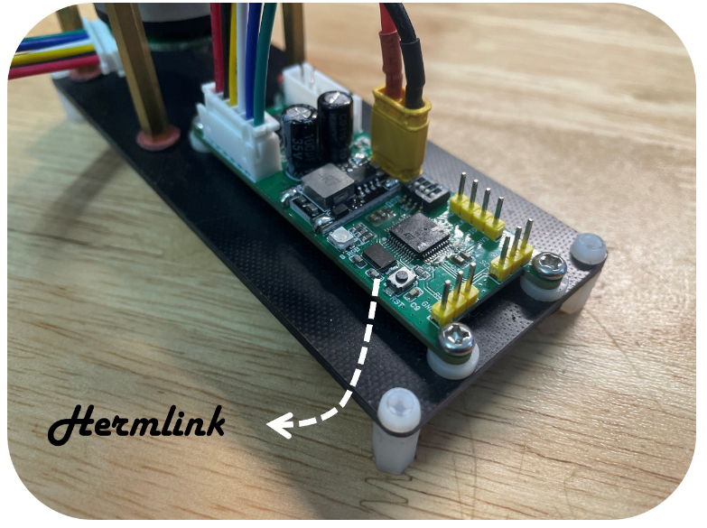
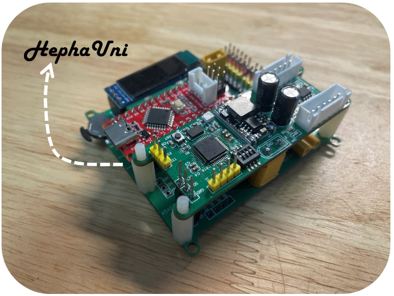
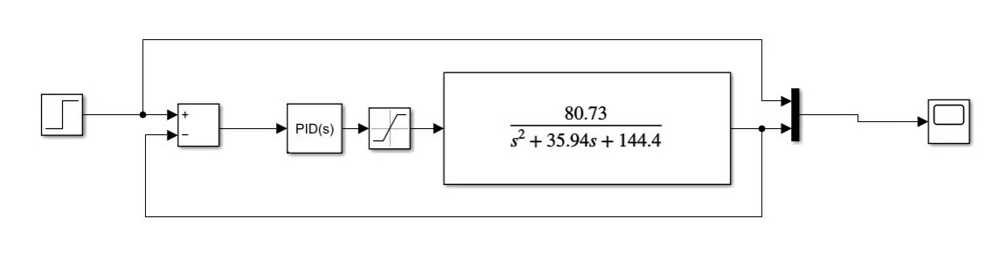
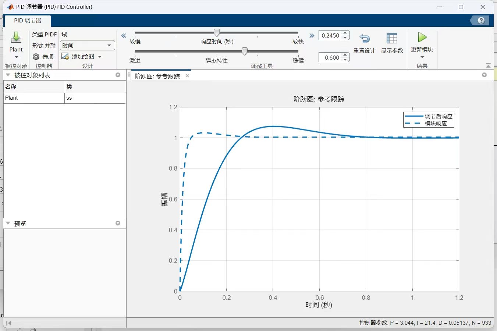
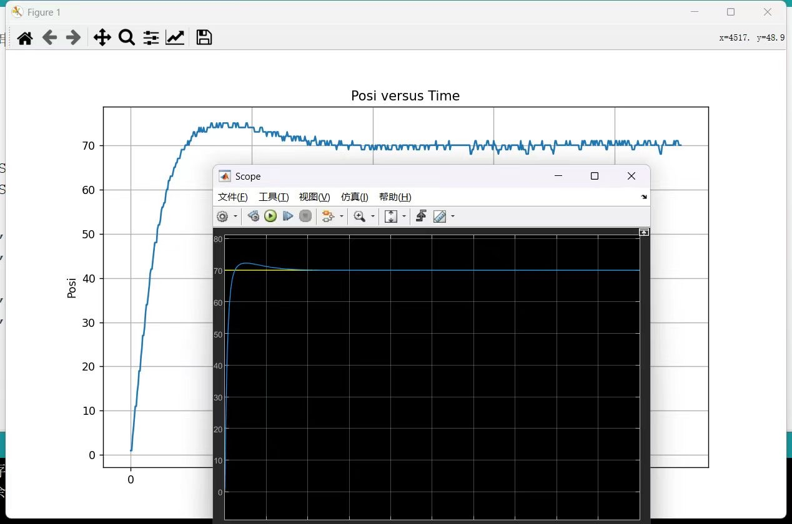
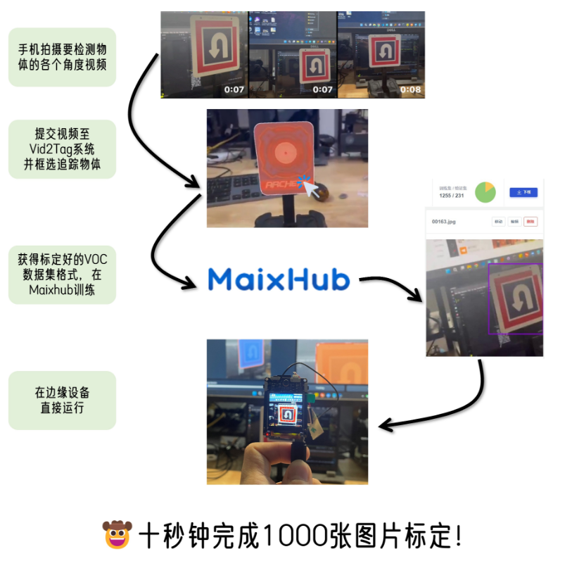

# Robots in studio
## What I have got in the past

Since June 2022, I have co-founded a robot studio with friends in Guangzhou. The studio focuses on designing and teaching robotics solutions for secondary schools. In this studio, my primary responsibilities include the design, implementation, and teaching of comprehensive robot solutions (including structural design, with a personal focus on software design). Since 2023, the robots designed by the studio have won championships in competitions in cities such as Guangzhou, Foshan, Zhuhai, and Dongguan. We have delivered over 150 units to date.

During the robot design process, we have integrated more advanced algorithms to maintain a strong competitive edge in the market with the same hardware. In the latest chassis design that I independently developed, I innovatively designed a bus motor control board based on I2C. This allows us to control a large number of motors, with support for up to 256 encoder motors, meeting the requirements of various robots.

Additionally, I designed a standardized communication protocol based on competition needs and integrated more advanced control algorithms into the motor drivers. For example, I used cascaded PID control and implemented trapezoidal velocity planning for precise motor control.

    <iframe src="//player.bilibili.com/player.html?aid=741855502&bvid=BV1gk4y1s7XU&cid=1149897581&page=1" scrolling="no" border="0" frameborder="no" framespacing="0" allowfullscreen="true" style="position:absolute; height: 100%; width: 100%;"> </iframe>

Furthermore, I developed an innovative Matlab-based upper computer that enables automatic motor identification, approximating the auto-tuning of velocity control PID. This greatly accelerated the overall development progress.

The implementation of excellent algorithms has resulted in outstanding motion performance for the chassis I designed. For instance, it achieves precise omnidirectional reciprocating motion within 2 meters with a cumulative error of less than 1 cm. This significantly accelerates the development of competition robots and reduces the difficulty of use for end-users. Moreover, the hardware cost of the solution remains comparable to conventional solutions in the market, greatly enhancing the competitiveness of our designed robots.

Furthermore, I have incorporated cutting-edge technology into robotics competitions for primary and secondary schools. I have developed a fully automatic image calibration system based on SAM, which enables automatic calibration of target patterns. This significantly improves the accuracy of recognition, addressing the issue of insufficient calibration images affecting recognition accuracy.

    <iframe src="//player.bilibili.com/player.html?aid=996833420&bvid=BV1qs4y1i7SL&cid=1149897762&page=1" scrolling="no" border="0" frameborder="no" framespacing="0" allowfullscreen="true" style="position:absolute; height: 100%; width: 100%;"> </iframe>

