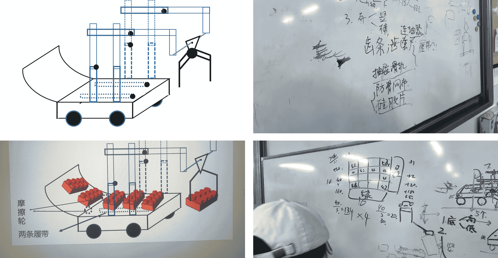
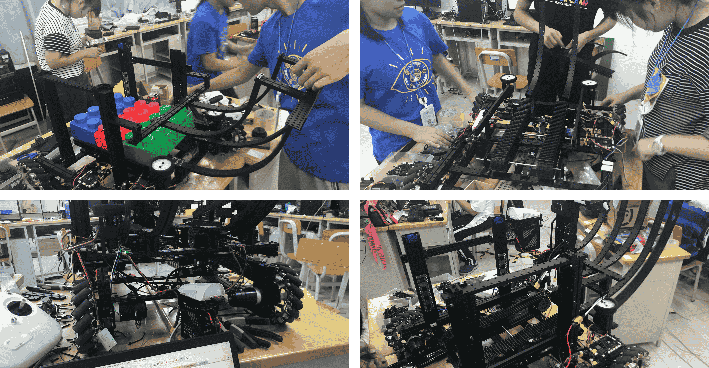
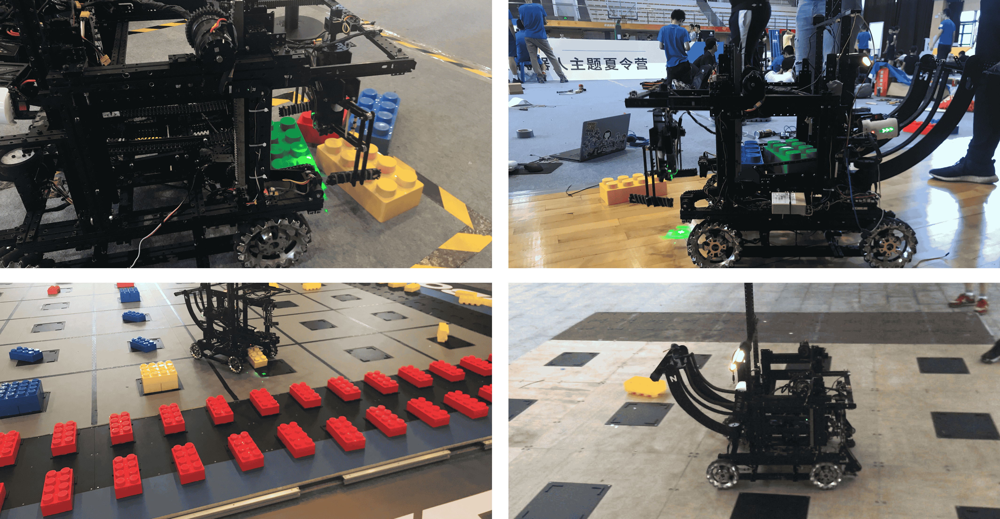

# About the project

In 2018, at the DJI RoboMaster summer camp for high-school students, I served as team captain and was mainly responsible for embedded development. The camp's task was to design and build a robot capable of grasping, storing and stacking building blocks. My responsibilities were:

- Coordinating between the mechanical, embedded and algorithm groups, keeping overall progress moving and resolving problems as they came up.
- On the embedded side, the kinematic analysis and actual control of a two-link arm — driving the chassis 3508 motors and the 6002 gimbal motor from an STM32 over CAN bus, and implementing block detection and dispensing control.
- Designing the communication protocol between the embedded system and the PC, mainly sending block corner positions over serial in JSON so the PC could optimize the grasp.

