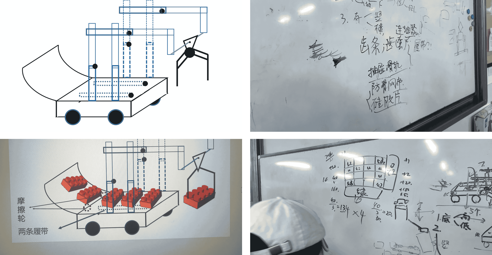
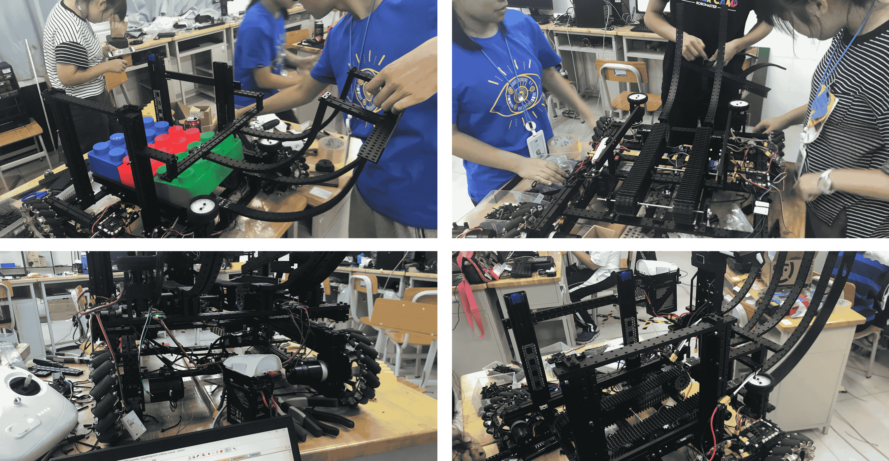
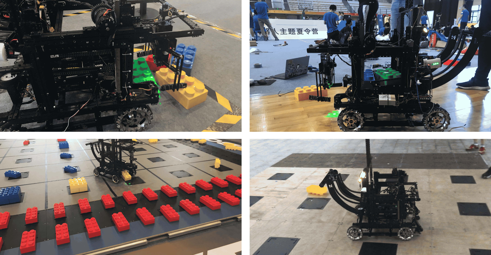

# Project Introduction

In 2018, during the DJI High School Summer Camp, I served as the team captain and was primarily responsible for embedded development. Our main task during the camp was to design and manufacture a robot capable of grasping, storing, and stacking building blocks. In the project, my responsibilities included:

- Coordinating and communicating with the structure, embedded systems, and algorithm teams to drive overall progress and resolve coordination issues.
- In the embedded systems part, I completed the kinematic analysis and actual control of the two-link mechanical arm. This involved controlling the arm's gripping mechanism based on STM32 and CAN to control the 3508 motors for the chassis and the 6002 gimbal motor. I also implemented material detection and control for material ejection.
- Designing the communication protocol between the embedded system and the PC, which primarily focused on transmitting block corner position information for optimized grasping to the PC using serial communication and JSON protocol.

