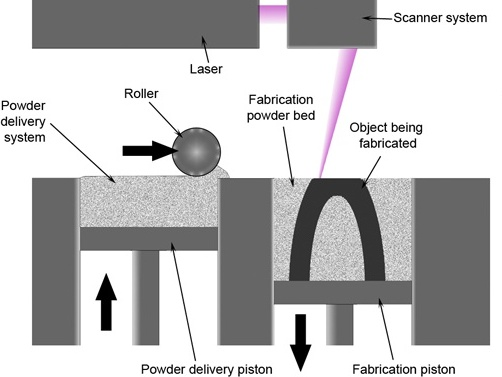
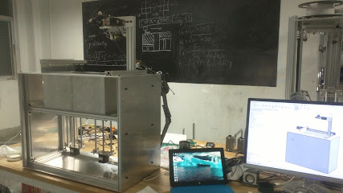

# Project Introduction

In 2018, during the DJI High School Summer Camp, I served as the team captain and was primarily responsible for embedded development. Our main task during the camp was to design and manufacture a robot capable of grasping, storing, and stacking building blocks. In the project, my responsibilities included:

- Coordinating and communicating with the structure, embedded systems, and algorithm teams to drive overall progress and resolve coordination issues.
- In the embedded systems part, I completed the kinematic analysis and actual control of the two-link mechanical arm. This involved controlling the arm's gripping mechanism based on STM32 and CAN to control the 3508 motors for the chassis and the 6002 gimbal motor. I also implemented material detection and control for material ejection.
- Designing the communication protocol between the embedded system and the PC, which primarily focused on transmitting block corner position information for optimized grasping to the PC using serial communication and JSON protocol.

<!-- I used to be a 3D printing enthusiast; I reproduced some open-source FDM printers like kossel in middle school and realized the limitations of FDM 3D printers. I learned that SLS is a high-precision 3D printing method and can even print metal.

So I spent about one year (2017~2018) building a desktop SLS 3d printer all by myself when I was in high school.
Although the project looks pretty naive now, the desktop SLS printer with the laser galvanometer had never been presented to the authors’ best knowledge at that time.

# Parts

## Laser Galvanometer System

The Laser galvanometer works the same as the voltmeter; the volt determines the angle of mirrors that reflect the laser. We use serial to communicate with the computer and receive the GCode(GCode is the most widely used numerical control programming language), process the GCode and plan, calculate the mirrors angle for each movement, use SPI to send the volt data to the DAC module, output the volt and make galvanometer turn to the corresponding angle.



## 2D Sintering Testing Platform

A 2d testing platform with a stage performance-grade galvanometer from AliExpress was made for single layer sintering. The platform and a nylon sintering test result are shown below.



## Powder Delivery System

The Powder Delivery System shown below, driven by three stepper motors, spreads the powder evenly over the previous layer. Two pistons store the printed part and the powder waiting to be used respectively.



# 3D Printer

Combining Laser Galvanometer and Powder Delivery System, we got an SLS 3D printer.

A dry run test video is shown below.



# Print result
I added toner in nylon to improve the ability to absorb laser energy, then printed complex geometric mechanisms, 3DBenchy, small chains to test the performance of the printer.



A printing process and small chain videos are shown below.





The printer can print complex structures without support, but the printing of large-scale parts is differential due to preheating the powder uniformly before sintering is very difficult. -->